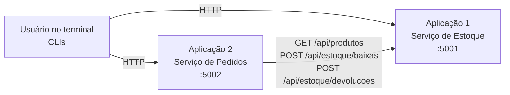

# Documentação das aplicações

## Visão geral

O projeto simula o back-office de uma pequena loja de informática e é composto por **duas aplicações independentes**, escritas em Python 3 com o micro-framework Flask, que se comunicam por **HTTP/JSON**:

| | Aplicação 1: Serviço de Estoque | Aplicação 2: Serviço de Pedidos |
|---|---|---|
| Pacote | `estoque_service/` | `pedidos_service/` |
| Porta padrão | 5001 | 5002 |
| Responsabilidade | Cadastro de produtos e controle de saldo | Registro de vendas (pedidos) e cancelamentos |
| Dados | Produtos (SKU, nome, preço, saldo, estoque mínimo) | Pedidos (cliente, itens, totais, status) |
| Depende de | nada | Serviço de Estoque (via `ESTOQUE_URL`) |
| Interface do usuário | CLI no terminal: `python -m estoque_service.cli` | CLI no terminal: `python -m pedidos_service.cli` |

O Serviço de Pedidos **não tem acesso direto aos dados do estoque**: toda consulta de catálogo, reserva (baixa) e devolução de produtos é feita chamando a API REST do Serviço de Estoque. É essa comunicação que os testes de integração verificam.



### Arquitetura interna (igual nas duas aplicações)

Cada aplicação segue uma arquitetura em camadas, o que permite testar cada parte isoladamente:

| Camada | Estoque | Pedidos | Função |
|---|---|---|---|
| HTTP (Flask) | `app.py` | `app.py` | Rotas, conversão JSON e mapeamento de erros para códigos HTTP |
| Serviço (casos de uso) | `servico.py` | `servico.py` | Orquestra as regras e garante atomicidade e exclusão mútua |
| Domínio | `dominio.py` | `dominio.py` | Entidades, validações e regras de negócio puras |
| Repositório | `repositorio.py` | `repositorio.py` | Armazenamento em memória (substituível por banco de dados) |
| Integração | n/a | `cliente_estoque.py` | Cliente HTTP do estoque: traduz respostas e falhas de rede em exceções |
| Interface (CLI) | `cli.py` | `cli.py` | Menu interativo no terminal que consome a API REST da própria aplicação |

As dependências são **injetadas pelo construtor** (`criar_app(servico)`, `ServicoPedidos(cliente_estoque, repositorio, relogio)`). Nos testes unitários elas são trocadas por dublês de teste. Nos testes de integração são usadas as implementações reais.

---

## Aplicação 1: Serviço de Estoque

### O que faz

Mantém o catálogo de produtos da loja e o saldo de cada um. Permite:

1. **Cadastrar produtos** com SKU (código único), nome, preço, quantidade inicial e estoque mínimo.
2. **Consultar** a lista de produtos ou um produto pelo SKU.
3. **Registrar entradas** (reposição de mercadoria).
4. **Baixar itens em lote** (reservar mercadoria para um pedido). A operação é **atômica**: se qualquer item não tiver saldo, nenhum item é baixado. A resposta informa o nome e o **preço vigente** de cada item.
5. **Devolver itens** (estorno de um pedido cancelado).
6. **Listar produtos que precisam de reposição** (saldo ≤ estoque mínimo).

### Endpoints

| Método | Rota | Descrição | Respostas |
|---|---|---|---|
| GET | `/health` | Verificação de saúde | 200 |
| GET | `/api/produtos` | Lista produtos (ordenados por SKU) | 200 |
| POST | `/api/produtos` | Cadastra produto | 201, 400, 409 |
| GET | `/api/produtos/{sku}` | Consulta produto | 200, 400, 404 |
| POST | `/api/produtos/{sku}/entradas` | Registra entrada `{"quantidade": n}` | 200, 400, 404 |
| GET | `/api/produtos/reposicao` | Produtos com saldo ≤ mínimo | 200 |
| POST | `/api/estoque/baixas` | Baixa em lote `{"itens": [{"sku", "quantidade"}]}` | 200, 400, 404, 409 |
| POST | `/api/estoque/devolucoes` | Devolução em lote (mesmo formato) | 200, 400, 404 |

Exemplo de baixa:

```http
POST /api/estoque/baixas
{"itens": [{"sku": "TEC-001", "quantidade": 2}]}

200 OK
{"itens": [{"sku": "TEC-001", "nome": "Teclado Mecânico", "preco": "250.00", "quantidade": 2, "saldo": 8}]}
```

Exemplo de erro padronizado (saldo insuficiente):

```http
409 CONFLICT
{"erro": "Estoque insuficiente para 'TEC-001': disponível 8, solicitado 50.",
 "codigo": "ESTOQUE_INSUFICIENTE", "sku": "TEC-001", "disponivel": 8, "solicitado": 50}
```

### Regras de negócio principais

* SKU único, com 3 a 20 caracteres (letras, números e hífen), normalizado para maiúsculas.
* Nome obrigatório (até 100 caracteres). Preço maior que zero e até R$ 1.000.000,00, arredondado em 2 casas (arredondamento comercial).
* Quantidades por operação são inteiras, de 1 a 10.000. O saldo nunca fica negativo e a capacidade máxima por produto é 100.000.
* Baixas e devoluções em lote são **tudo ou nada**. SKUs repetidos no lote são somados.
* Todas as operações de escrita são protegidas por *lock*, de modo que requisições simultâneas não vendem além do saldo.

---

## Aplicação 2: Serviço de Pedidos

### O que faz

Registra as vendas da loja. Para cada pedido:

1. **Valida** o cliente e os itens (quantidade, SKU, limites).
2. **Chama o Serviço de Estoque** para reservar (baixar) todos os itens de uma vez. O estoque devolve o **preço oficial** de cada produto, e o preço que o cliente eventualmente enviar é ignorado.
3. **Calcula os totais** com **desconto progressivo**:

   | Subtotal | Desconto |
   |---|---|
   | abaixo de R$ 500,00 | 0% |
   | de R$ 500,00 a R$ 999,99 | 5% |
   | a partir de R$ 1.000,00 | 10% |

4. **Registra o pedido** com status `CONFIRMADO`.

Também permite **cancelar** um pedido confirmado, o que devolve os itens ao estoque e muda o status para `CANCELADO`, além de **listar/consultar pedidos**, **exibir o catálogo** (obtido do estoque) e **informar a saúde** da dependência.

### Endpoints

| Método | Rota | Descrição | Respostas |
|---|---|---|---|
| GET | `/health` | Saúde do serviço e da dependência (estoque) | 200 |
| GET | `/api/catalogo` | Catálogo vindo do Serviço de Estoque | 200, 502, 503 |
| GET | `/api/pedidos` | Lista pedidos (mais recente primeiro) | 200 |
| POST | `/api/pedidos` | Cria pedido `{"cliente", "itens": [{"sku", "quantidade"}]}` | 201, 400, 409, 422, 502, 503 |
| GET | `/api/pedidos/{id}` | Consulta pedido | 200, 404 |
| POST | `/api/pedidos/{id}/cancelamento` | Cancela pedido e devolve itens ao estoque | 200, 404, 409, 503 |

### Tratamento das respostas do estoque

| Situação no Serviço de Estoque | Resposta do Serviço de Pedidos |
|---|---|
| Baixa realizada | 201 Created (pedido confirmado) |
| Saldo insuficiente (409 `ESTOQUE_INSUFICIENTE`) | 409 Conflict, sem pedido registrado |
| Produto inexistente (404 `PRODUTO_NAO_ENCONTRADO`) | 422 Unprocessable Entity |
| Estoque fora do ar, recusa de conexão, timeout ou 5xx | 503 Service Unavailable |
| Resposta fora do contrato (JSON inválido, campos ausentes) | 502 Bad Gateway |

Se o estoque estiver indisponível durante um **cancelamento**, o pedido **permanece CONFIRMADO**. Assim os dois serviços nunca ficam inconsistentes (o pedido não é cancelado sem que a mercadoria volte ao estoque).

### Configuração (variáveis de ambiente)

| Variável | Padrão | Uso |
|---|---|---|
| `ESTOQUE_HOST` / `ESTOQUE_PORTA` | 127.0.0.1 / 5001 | Endereço do Serviço de Estoque |
| `PEDIDOS_HOST` / `PEDIDOS_PORTA` | 127.0.0.1 / 5002 | Endereço do Serviço de Pedidos |
| `ESTOQUE_URL` | `http://127.0.0.1:5001` | URL que o Pedidos usa para chamar o Estoque |
| `ESTOQUE_TIMEOUT` | 3 | Tempo limite (segundos) das chamadas ao Estoque |

---

## Como executar

Pré-requisito: Python 3.10 ou superior.

```bash
python -m venv .venv
# Linux/macOS: source .venv/bin/activate   |   Windows: .venv\Scripts\activate
pip install -r requirements-dev.txt

# Terminal 1: Aplicação 1
python -m estoque_service          # http://127.0.0.1:5001

# Terminal 2: Aplicação 2
python -m pedidos_service          # http://127.0.0.1:5002
```

Com os dois servidores no ar, abra mais dois terminais e use as interfaces de linha de comando:

```bash
# Terminal 3: CLI do Estoque (cadastrar, listar, registrar entrada, reposição)
python -m estoque_service.cli

# Terminal 4: CLI de Pedidos (catálogo, criar, listar, cancelar, situação dos serviços)
python -m pedidos_service.cli
```

Exemplo de uso da CLI de Pedidos:

```text
==================================================
  SERVIÇO DE PEDIDOS  (http://127.0.0.1:5002)
==================================================
  1) Ver catálogo (produtos do Estoque)
  2) Criar pedido
  3) Listar pedidos
  4) Cancelar pedido
  5) Situação dos serviços
  0) Sair
Opção: 2

Cliente: Maria Souza
Informe os itens (SKU em branco para finalizar).
  SKU: TEC-001
  Quantidade: 2
  SKU: MOU-001
  Quantidade: 1
  SKU:
OK: pedido confirmado!
Pedido #1 - Maria Souza - CONFIRMADO
   TEC-001    Teclado mecânico           2 x    R$ 250,00 =     R$ 500,00
   MOU-001    Mouse sem fio              1 x    R$ 120,00 =     R$ 120,00
   Subtotal R$ 620,00 | Desconto 5% (-R$ 31,00) | TOTAL R$ 589,00
```

As CLIs também aceitam as variáveis `ESTOQUE_URL` e `PEDIDOS_URL` para apontar para outro endereço. Erros da API aparecem com o código HTTP e a mensagem, por exemplo `ERRO (HTTP 409): Estoque insuficiente para 'MON-001': disponível 2, solicitado 5.`

## Tecnologias

* **Python 3.11** e **Flask 3** (APIs REST); interface de linha de comando com a biblioteca padrão (`input`/`print`)
* **requests** (cliente HTTP entre as aplicações)
* **pytest**, **pytest-cov** (coverage.py com cobertura de ramos) e **pytest-html** (testes e relatórios)
* **Playwright** e **xterm.js** (somente para gravar o vídeo dos terminais e gerar o PDF de evidências)

## Limitações conhecidas

* Os dados ficam em memória: reiniciar um serviço apaga seus dados. O repositório foi isolado em uma classe própria justamente para permitir a troca por um banco de dados.
* Se a conexão cair **depois** de o estoque efetivar uma baixa mas **antes** de o Pedidos receber a resposta, a mercadoria fica reservada sem pedido. Em produção isso seria resolvido com chaves de idempotência ou com o padrão *Saga*. O cenário está fora do escopo do trabalho.
